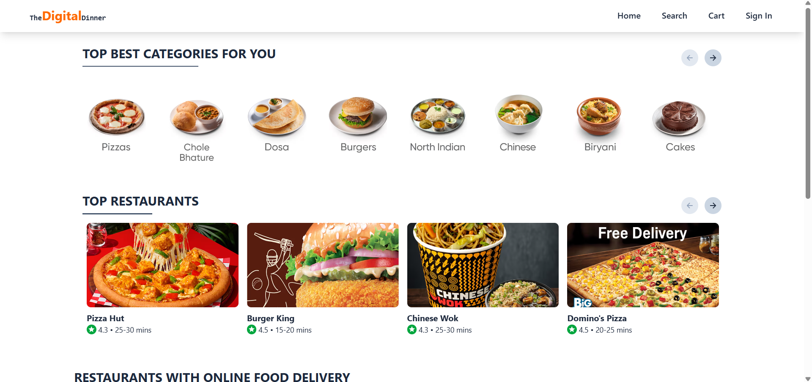

<h1 align="center" style="color: #ff4500;">🍽️ theDigitalDinner</h1>
<p align="center"><strong>A Swiggy-like food delivery app built with the MERN stack</strong></p>

<p align="center">
  
</p>

<p align="center">
  <a href="https://the-digital-dinner.onrender.com/" target="_blank" style="text-decoration: none; background-color: #ff4500; color: white; padding: 10px 20px; border-radius: 8px; font-weight: bold;">
    🚀 Live Demo
  </a>
</p>

<hr/>

<h2 style="color: #ff6347;">🧑‍🍳 Frontend Features & Tech Stack</h2>

<ul>
  <li>⚛️ React with Vite for blazing-fast development</li>
  <li>💅 Tailwind CSS for beautiful and responsive UI</li>
  <li>🧠 State management with Redux</li>
  <li>💡 Performance: <code>React.memo</code>, <code>useMemo</code>, <code>useCallback</code>, lazy loading</li>
  <li>🔎 Advanced search with suggestions and real-time filtering</li>
  <li>✨ Shimmer UI for loading placeholders</li>
  <li>🛒 Cart functionality synced with backend</li>
  <li>🧾 Only one brand/cart restriction with notifications</li>
  <li>🔐 User authentication: Signup, Login, Logout</li>
  <li>🔔 Beautiful notifications with <code>react-hot-toast</code></li>
  <li>🎠 Carousels and banners with <code>react-slick</code></li>
  <li>🎨 Icons using <code>react-icons</code></li>
  <li>📦 API communication using <code>axios</code></li>
  <li>✅ Form validation using <code>validator</code> (client + server)</li>
</ul>

<hr/>

<h2 style="color: #4682b4;">🧰 Backend Features & Tech Stack</h2>

<ul>
  <li>🟢 Node.js + Express for REST API</li>
  <li>🍃 MongoDB with Mongoose for database and schema validation</li>
  <li>🔐 JWT for secure authorization</li>
  <li>🔐 Password hashing with <code>bcrypt</code></li>
  <li>🛡️ Secure cookie-based sessions with <code>cookie-parser</code></li>
  <li>🌐 <code>cors</code> configuration to allow frontend access</li>
  <li>🔒 Environmental variables via <code>dotenv</code></li>
  <li>🔥 Auto server reloads using <code>nodemon</code></li>
</ul>

<hr/>

<h2 style="color: #20c997;">📷 Preview</h2>
<ul>
  <li>Top Categories</li>
  <li>Trending & Regular Cards</li>
  <li>Restaurant-specific Menus & Suggestions</li>
  <li>Search functionality</li>
  <li>Shimmer loading UI</li>
  <li>User-friendly toast notifications</li>
</ul>

<p align="center">
  
</p>

<hr/>

<h2 style="color: #8a2be2;">📦 Folder Structure</h2>

```bash
theDigitalDinner/
├── client/             # React frontend
│   └── ...
├── server/             # Express backend
│   └── ...
└── README.md           # Showcase Client & Server